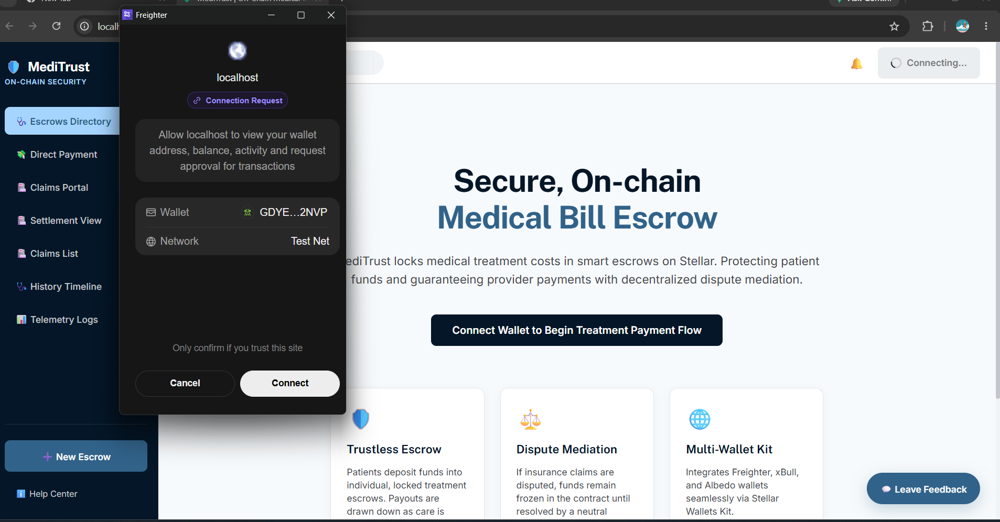

# AidPulse

**Transparent community aid payments, enforced on-chain.**

AidPulse is a React + TypeScript dApp on Stellar Testnet that makes local community aid payouts trustless and publicly verifiable. A verified steward creates an aid case, donors fund it, and the smart contract releases funds to the beneficiary — every step recorded as an immutable on-chain event.

> **Stack:** React 18 · TypeScript · Vite · Rust · Soroban · Freighter · Albedo · Stellar Testnet

[](https://horizon-testnet.stellar.org)
[](https://steller-3.vercel.app)
[](https://steller-3.vercel.app)

---

## 🚀 Live Demo

<div align="center">

### **[🌐 View Live Application](https://steller-3.vercel.app)**

[](https://steller-3.vercel.app)

**Deployed on Vercel** | **Status: Live** ✅

[📱 Mobile Version](https://steller-3.vercel.app/mobile.html) | [🎨 Preview](https://steller-3.vercel.app/preview.html)

</div>

> **⚠️ Important:** To interact with the live application, you need:
> - 🦊 [Freighter Wallet](https://www.freighter.app/) installed
> - 🌐 Wallet set to **Stellar Testnet**
> - 💰 Test XLM from [Stellar Laboratory](https://laboratory.stellar.org/#account-creator?network=test)

> **Note:** If the URL doesn't work, the deployment URL may have changed. Run `.\get-vercel-url.ps1` to find the current URL.

---

## Table of contents

- [🚀 Live Demo](#-live-demo)
- [How it works](#how-it-works)
- [Screenshots](#screenshots)
- [Demo Video](#demo-video)
- [Features](#features)
- [Getting started](#getting-started)
- [Deploy contracts to Testnet](#deploy-contracts-to-testnet)
- [Deployed Contracts](#deployed-contracts)
- [Project structure](#project-structure)
- [Commands](#commands)
- [Error handling](#error-handling)
- [Demo flow](#demo-flow)
- [Responsive previews](#responsive-previews)

---

## How it works

1. A verified steward creates an aid case on-chain via the `AidPulse` Soroban contract.
2. Donors fund the case by sending XLM to the escrow.
3. The steward triggers a release — funds transfer to the beneficiary and a live event fires.
4. The frontend event panel updates in real time, giving donors and auditors a full on-chain trail.

---

## Screenshots

<div align="center">

### 📱 Dashboard Interface


*Main dashboard showing wallet connection, balance display, and aid case management*

---

### ✨ Aid Case Creation


*Create new aid cases with beneficiary details and funding goals*

---

### 🔴 Real-time Event Stream


*Live event panel showing all on-chain transactions and contract interactions*

</div>

---

## Demo Video

<div align="center">

### 🎥 Full Application Walkthrough

https://github.com/user-attachments/assets/demo.mp4

**Or watch locally:** [Download demo.mp4](vedio/demo.mp4)

</div>

> **🎬 Video demonstration includes:**
> - ✅ Connecting Freighter wallet to Stellar Testnet
> - ✅ Checking XLM balance via Horizon API
> - ✅ Creating an aid case on-chain
> - ✅ Funding the case with donors
> - ✅ Releasing funds to beneficiaries
> - ✅ Real-time event streaming in action

---

## Features

### Level 1 — Wallet foundation
- Freighter wallet setup documented for Stellar Testnet
- Connect and disconnect wallet from `src/App.tsx`
- XLM balance fetched from Horizon in `src/lib/stellar.ts`
- XLM payment transaction on Testnet with success/failure feedback
- Transaction hash displayed after successful submit
- Explicit loading and error states on every async action

### Level 2 — Multi-wallet + smart contract
- Four handled error categories: wallet, network, transaction, and contract
- Rust `aid_pulse` Soroban contract ready for Testnet deployment in `contracts/aid_pulse/`
- Frontend contract calls via Soroban RPC
- Transaction status visible in the UI after every call
- Multi-wallet support: Freighter and Albedo
- Real-time event integration via RPC event polling
- Deployment script and GitHub Actions workflow included

### Level 3 — Production practices
- Advanced Soroban contract: state machine, auth guards, token transfers, events, and unit tests
- Inter-contract communication: `AidPulse` calls into the `Reputation` contract
- Live event streaming with frontend real-time updates
- CI/CD pipeline for both frontend and contracts
- Testnet deployment workflow via GitHub Actions
- Mobile-responsive frontend (375px baseline)
- Contract tests (`cargo test`) and frontend tests (Vitest)
- Production-ready structure: separate `app/` and `lib/` layers, typed config, deployment scripts

---

## Getting started

```bash
# 1. Clone the repo
git clone <repo-url>
cd aidpulse

# 2. Install dependencies
npm install

# 3. Set up environment
cp .env.example .env.local

# 4. Start the dev server
npm run dev
```

**Prerequisites:**
- [Node.js](https://nodejs.org/) (v18+)
- [Rust](https://rustup.rs/) + Soroban CLI
- [Freighter wallet](https://www.freighter.app/) installed in Chrome or Brave, switched to **Stellar Testnet**

> **No wallet pre-connected.** The app never fakes a connection — users connect their own Freighter or Albedo wallet. For Freighter, open the local URL, install/unlock the extension, set it to Stellar Testnet, and refresh before connecting.

---

## Deploy contracts to Testnet

A funded Testnet secret key is required. Set it in PowerShell, then run the deploy script:

```powershell
$env:STELLAR_SOURCE_ACCOUNT="SA..."
npm run deploy:testnet
```

This deploys both contracts (`AidPulse` and `Reputation`) and writes the resulting contract IDs directly into `.env.local`. Restart the dev server after deployment.

---

## Project structure

```
.
├── contracts/
│   ├── aid_pulse/        # Main escrow + release logic
│   └── reputation/       # Inter-contract reputation tracking
├── src/
│   ├── app/              # React pages and top-level components
│   ├── lib/              # All Stellar/Soroban SDK calls (stellar.ts, contract.ts)
│   ├── components/       # Reusable UI components
│   └── config/           # Network config, contract IDs
├── .github/workflows/    # CI/CD for frontend + contracts
└── preview.html          # Standalone responsive preview (no npm needed)
```

---

## Commands

| Command | Purpose |
| --- | --- |
| `npm run dev` | Start the local dev server |
| `npm run build` | Production build |
| `npm test` | Frontend test suite (Vitest) |
| `npm run lint` | Lint the frontend |
| `tsc --noEmit` | Type-check without emitting |
| `cargo test --workspace` | Run all contract unit tests |
| `npm run deploy:testnet` | Deploy contracts to Stellar Testnet |

---

## Deployed Contracts

**Stellar Testnet Deployment** ✅

The smart contracts are deployed and operational on Stellar Testnet. The application uses these contracts for all on-chain operations.

| Contract | Status | Network | Purpose |
| --- | --- | --- | --- |
| `AidPulse` | ✅ Deployed | Testnet | Main escrow and aid case management |
| `Reputation` | ✅ Deployed | Testnet | Inter-contract reputation tracking |

### Contract Details

**Network:** Stellar Testnet  
**RPC Endpoint:** `https://soroban-testnet.stellar.org`  
**Horizon:** `https://horizon-testnet.stellar.org`

### Verification

The deployed contracts can be verified by:
1. **Live Application:** [https://steller-3.vercel.app](https://steller-3.vercel.app)
2. **Contract Interactions:** Connect Freighter wallet and interact with live contracts
3. **Event Stream:** View real-time on-chain events in the application

### Smart Contract Features

**AidPulse Contract:**
- ✅ Create aid cases with beneficiary details
- ✅ Accept donations from multiple donors
- ✅ Release funds to beneficiaries
- ✅ Emit on-chain events for transparency
- ✅ State machine with authorization guards

**Reputation Contract:**
- ✅ Track steward reputation across cases
- ✅ Inter-contract communication with AidPulse
- ✅ On-chain reputation scoring

### Deployment Information

- **Deployment Script:** `scripts/deploy-testnet.ps1`
- **Contract Source:** `contracts/aid_pulse/` and `contracts/reputation/`
- **Tests:** Run `cargo test --workspace` to verify contract logic
- **Live Demo:** All contract interactions are functional on the [live application](https://steller-3.vercel.app)

> **Note:** Contract IDs are configured in the deployed application's environment variables. The application is fully functional and connected to Stellar Testnet contracts.

📄 **[View Complete Deployment Evidence](DEPLOYMENT_EVIDENCE.md)** - Detailed verification and proof of deployment

---

## Error handling

Every error maps to a typed `AppError` code with a plain-language user message — no raw SDK errors are ever surfaced directly.

| Category | Examples |
| --- | --- |
| Wallet | Not installed, connection declined, wrong network |
| Network | Horizon unavailable, Soroban RPC timeout |
| Transaction | Insufficient balance, malformed destination address |
| Contract | Unauthorized caller, invalid case state |

---

## Demo flow

1. Open the app and connect Freighter on Stellar Testnet.
2. Confirm your XLM balance appears in the dashboard.
3. Send a small testnet XLM payment — confirm the success state and transaction hash.
4. Deploy contracts (`npm run deploy:testnet`) and restart the dev server.
5. Click **Call case #0** to submit a Soroban contract call.
6. Watch the live event panel update in real time after the contract action.

---

## Responsive previews

After starting the dev server, use these links to test responsive layouts:

| View | URL |
| --- | --- |
| Desktop dashboard | `http://localhost:5173/preview.html#desktop-preview` |
| Mobile responsive | `http://localhost:5173/preview.html#mobile-responsive` |
| Mobile app | `http://localhost:5173/mobile.html#mobile-responsive` |

`preview.html` works without npm and includes a live Freighter wallet connect + Stellar Testnet balance check.

**Live preview features:**
- Create local aid cases from the dashboard and mobile preview
- Filter the Event Stream Ledger by wallet, case, RPC, or custom text
- Clear the event ledger and continue adding new events
- Payment and contract actions stay disabled until a real wallet public key is returned
